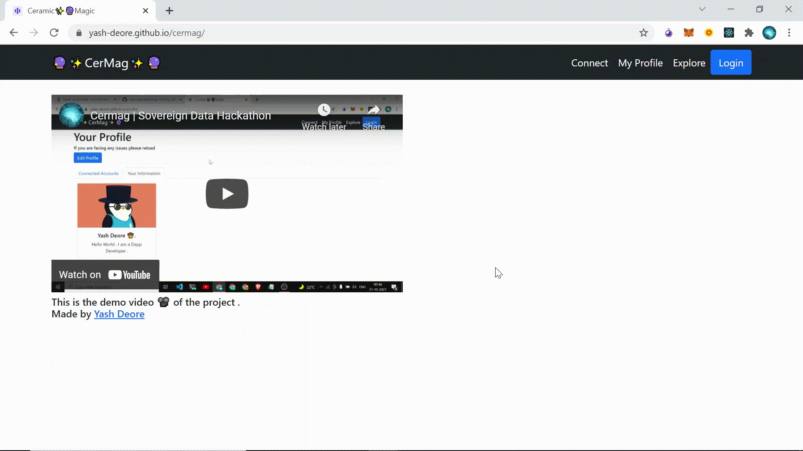

# CerMag

> # 👀 Preview GIFs 👀 :

<p >
  
</p>

<br />

<p >
  
</p>

> # 🔗 Links 🔗 :

Issue : https://github.com/ceramicnetwork/ceramic/issues/86 <br />
Submission : https://gitcoin.co/hackathon/ceramic-identity/projects/11258/cermag <br />
Demo Video : https://youtu.be/MeKzW_Ej2M0 <br />
Website : https://yash-deore.github.io/cermag/ <br />

> # 💡 Features of this Dapp 💡 :

```
1 . Authenticates the user using Magic.
2 . If the user is registered then display their profile or redirect the user to the register page.
3 . Let the user edit their profile and update their profile after editing.
4 . Let the user create chatrooms, join chatrooms, and interact with others.
```

> # 🐱‍👤 Issues resolved by this Dapp 🐱‍👤 :

```
1 . It authenticates the user using their Gmail account.
2 . It uses the DID Datastore to store the user's information.
3 . It lets the user view/edit their profile.
4 . It enables the user to log in to the same profile even if they are using a different email address.
```

> # 🤟 Motivation 🤟

```
1 . Learning about decentralized identities.
2 . Learning about Ceramic and Magic.
3 . Testing and improving my skills.
4 . Taking part in a Virtual Hackathon.
5 . Interacting with the community of Dapp Developers.
6 . Interacting with professionals working in this field.
```

> # 💳 Credits 💳 :

```
1 . Thanks a lot to the Gitcoin team for organizing the Sovereign Data Hackathon and letting me be a part of it.
2 . Thanks a lot to all for all the Workshops as they have helped me learn a lot and increase my field of view as a Dapp Developer.
3 . Finally I would like to thank the Ceramic and Magic discord team for clearing all the doubts I have had and guiding me through all the errors that I faced
4 . Thanks a lot to everyone 😀 . It was an awesome experience 👍 .
```
